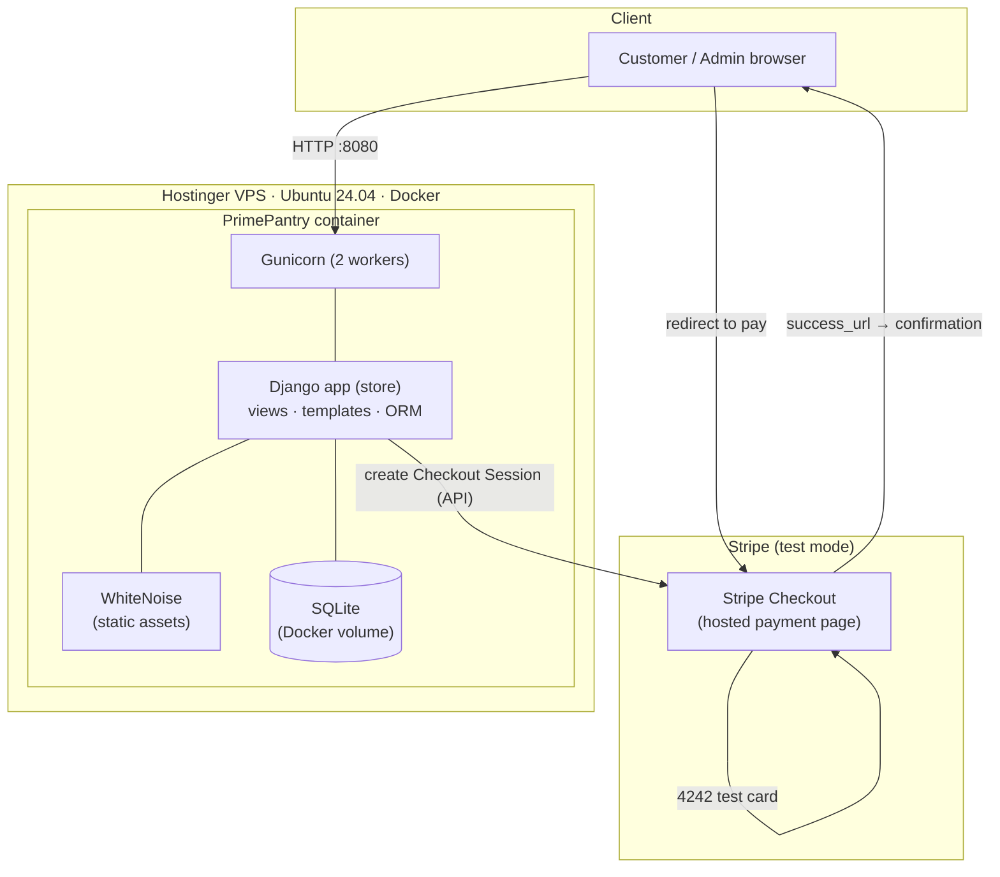
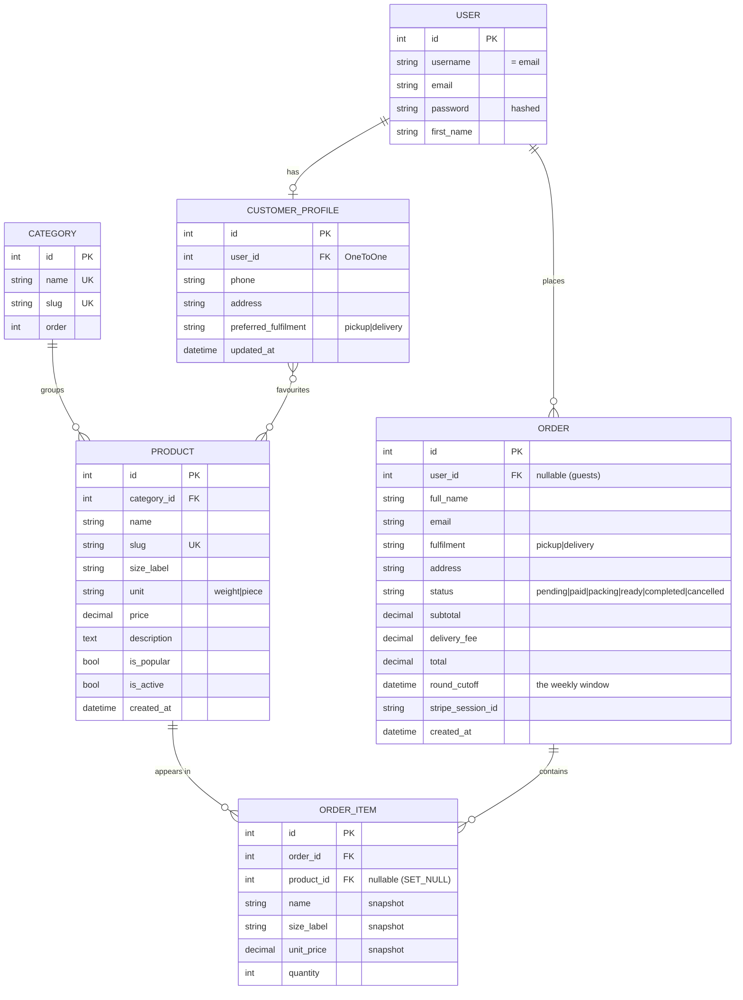

# Design

This page documents the **architecture**, **database** and **user-interface** design of
PrimePantry. Diagrams are written in Mermaid and render directly on GitHub.

- [1. Architecture design](#1-architecture-design)
- [2. Database design](#2-database-design)
- [3. User-interface design](#3-user-interface-design)

---

## 1. Architecture design

PrimePantry is a server-rendered **Django** application. It is packaged as a **Docker**
image and runs on a Hostinger VPS behind **Gunicorn**, alongside a second, unrelated Docker
stack that already owns ports 80/443, so PrimePantry is published on port **8080**. Static
files (CSS is inline; images/video are assets) are served by **WhiteNoise** from inside the
app, so no separate web server is needed for them. Payments are delegated to **Stripe
Checkout** (hosted, test mode) — the app never handles raw card data.

**Request flow for an order**

1. Browser hits Gunicorn on `:8080`; Django renders pages from the `store` app.
2. On *Place order*, Django creates a `pending` `Order` and a **Stripe Checkout Session**,
   then redirects the browser to Stripe's hosted page.
3. The customer pays with a test card; Stripe redirects back to the confirmation URL.
4. The confirmation view verifies `payment_status == paid`, marks the order **Confirmed**
   and clears the cart.

**Key decisions & justification**

| Decision | Why |
|----------|-----|
| Django (server-rendered) | Batteries-included: ORM, auth, admin, testing, migrations — fastest path to a correct, maintainable solution for a small team. |
| Built-in Django admin | Delivers "service provider manages products/orders" almost for free (criterion: *what is needed, on budget*). |
| SQLite in a Docker volume | Zero-config, persists across image rebuilds; ample for the assignment's data volume. |
| Stripe Checkout (hosted) | PCI-safe — card details are entered on Stripe, never on our server. Test mode = no real money. |
| WhiteNoise | Serves static assets from the app; avoids a second web server on a small VPS. |
| Docker + Gunicorn | Reproducible builds and one-command updates (`git pull && docker compose up -d --build`). |

See [DEPLOY.md](../DEPLOY.md) for the full deployment topology.

---

## 2. Database design

Six tables model the domain. `User` is Django's built-in auth user; the rest live in the
`store` app.

**Notes on the schema**

- **Group-buying window** — each `Order.round_cutoff` records the weekly cutoff (next
  Wednesday 18:00, Australia/Brisbane) the order belongs to. The admin *Aggregate quantities*
  view sums `OrderItem.quantity` per product **for the current window** — this is the USP
  (Problem 04: no more manual tallying).
- **Price/name snapshots** — `OrderItem` copies `name`, `size_label` and `unit_price` at
  purchase time so historical orders stay correct even if a product later changes or is
  deleted (`product` FK is `SET_NULL`).
- **Guest vs. account** — `Order.user` is nullable: guests can check out; logged-in users get
  their orders linked, plus a `CustomerProfile` (saved contact/delivery details and a
  many-to-many **favourites** list).
- **Login by email** — accounts store the email in `username`, so users sign in with email.

The schema is created by migrations `0001`–`0004` and seeded from
[`store/fixtures/catalog.json`](../store/fixtures/catalog.json) (7 categories, 42 products).

---

## 3. User-interface design

The UI follows a single, deliberately minimal design system nick-named **"INO"** — a
monochrome, editorial look inspired by high-end catalogue sites.

**Design language**

| Token | Value |
|-------|-------|
| Palette | `#212123` ink · `#ffffff` bone · `#999999` / `#a6a6a7` greys — strictly achromatic |
| Type | Jost 400, uppercase, wide letter-spacing (hierarchy comes from case & spacing, not size) |
| Shape | 8px cards, 50px pill controls, no shadows/gradients (flat) |
| Motion | Live cutoff countdown; shimmer sweep on the hero call-to-action; looping hero video |
| Nav | Top header on inner pages; bottom dot-navigation echoing the design source |

**Screens (mock-up → built).** The clickable mock-ups were produced in Claude's design tool
and are realised 1-to-1 in the app. Each screen can be viewed live:

| Screen | Live URL |
|--------|----------|
| Home (hero, popular, collections) | http://147.93.56.126:8080/ |
| Catalog (search + category filter) | http://147.93.56.126:8080/catalog/ |
| Product detail | http://147.93.56.126:8080/catalog/ → any product |
| Cart | http://147.93.56.126:8080/cart/ |
| Checkout (fulfilment, contact, pay) | add an item → http://147.93.56.126:8080/checkout/ |
| Order confirmation | after a test payment |
| Sign in / register | http://147.93.56.126:8080/account/sign-in/ |
| My orders | http://147.93.56.126:8080/orders/ |
| Admin · Aggregate quantities (USP) | http://147.93.56.126:8080/staff/quantities/ (staff login) |

> 📸 **For the marker:** add PNG screenshots of each screen under `docs/screenshots/` and
> embed them here, e.g. ``. The live URLs above show the
> current, deployed UI.

**Accessibility & responsiveness** — semantic headings and labelled controls; grids collapse
to a single column on narrow screens (`@media` rules in the catalog, cart and checkout).
